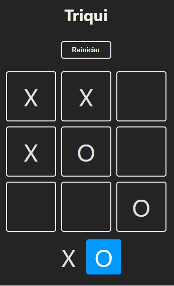
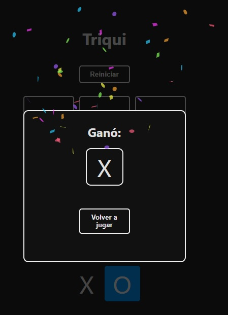

# Juego Triqui realizado con React

### Imagenes de muestra de la App
 

#### En el juego está la opción de reiniciar la partida o volver a jugar después de tener un ganador o haber finalizado la partida.
 
<figure>
    
    <figcaption>Jugando!</figcaption>
    
</figure>    

<figure>
    
    <figcaption>Ganador en modal con confeti!</figcaption>
</figure>
